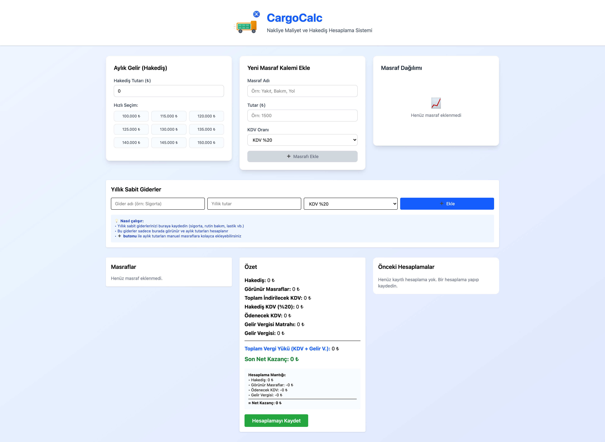
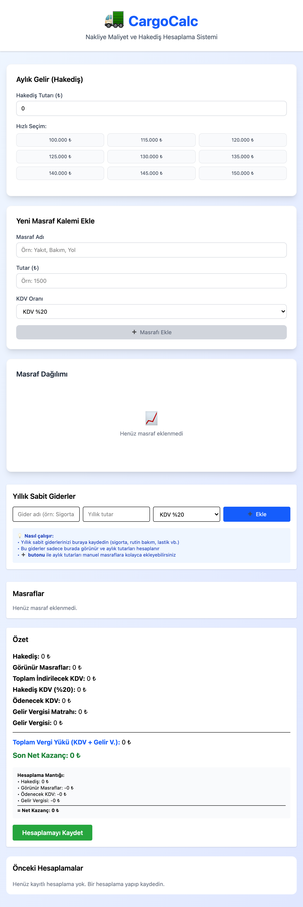
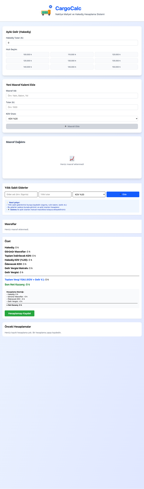

# 🚚 CargoFlow

**Nakliye Maliyet ve Hakediş Hesaplama Sistemi**

CargoFlow, nakliye işletmeleri için özel olarak geliştirilmiş, kapsamlı maliyet takibi ve vergi hesaplama uygulamasıdır. Türkiye'nin güncel vergi sistemine uygun olarak tasarlanmıştır.

<div align="center">
<strong>MASAÜSTÜ GÖRÜNÜMÜ</strong></br>
   </br>
  <strong>TABLET GÖRÜNÜMÜ</strong></br>
  </br>
  <strong>MOBİL GÖRÜNÜMÜ</strong></br>
  
</div>

## ✨ Özellikler

### 🧮 **Akıllı Vergi Hesaplama**
- **KDV Hesaplama**: Otomatik KDV indirimi ve ödenecek KDV hesaplaması
- **Gelir Vergisi**: Türkiye vergi dilimlerine göre otomatik hesaplama
- **Net Kazanç**: Tüm vergiler düşülmüş net kar hesabı

### 📊 **Görsel Analiz**
- **İnteraktif Donut Chart**: Masraf kategorilerinin dağılımı
- **Akıllı Kategorizasyon**: Yakıt, yol, bakım, yemek, fatura, diğer
- **Renkli Gösterimler**: Her kategori için özel renk ve ikon

### 💰 **Maliyet Yönetimi**
- **Elle Masraf Ekleme**: Validation'lı güvenli veri girişi
- **Yıllık Sabit Giderler**: Sigorta, bakım, lastik vb. otomatik aylık dağılım
- **Hızlı Silme**: Hover efekti ile kolay masraf silme

### 📈 **Geçmiş Takibi**
- **Otomatik Kaydetme**: Tüm hesaplamalar localStorage'da saklanır
- **Detaylı Geçmiş**: Masraf detayları, vergi bilgileri, tarih
- **Kolay Yönetim**: Tek tek veya toplu silme imkânı

### 🎨 **Modern UI/UX**
- **Toast Notifications**: Şık bildirimler (başarı, uyarı, hata)
- **Responsive Design**: Mobil ve desktop uyumlu
- **Validasyon Sistemi**: Gerçek zamanlı form kontrolleri
- **Gradient Tasarım**: Modern ve profesyonel görünüm

## 🚀 Kurulum

### Gereksinimler
- Node.js 16+
- npm veya yarn

### Adımlar

```bash
# Projeyi klonlayın
git clone https://github.com/ebudemirkazik/CargoFlow.git

# Proje dizinine girin
cd CargoFlow

# Bağımlılıkları yükleyin
npm install

# Geliştirme sunucusunu başlatın
npm run dev
```

Uygulama http://localhost:5173 adresinde çalışacaktır.

## 📱 Kullanım

### 1. **Temel Hesaplama**
1. **Hakediş tutarını** girin (KDV dahil)
2. **Masrafları** ekleyin (yakıt, yol, bakım vb.)
3. **KDV oranlarını** seçin (%0, %1, %10, %20)
4. Otomatik hesaplanan **net kazancı** görün

### 2. **Sabit Giderler**
1. Yıllık sabit giderlerinizi ekleyin
2. Otomatik aylık dağılımı görün
3. KDV indirimlerini takip edin

### 3. **Raporlama**
1. **Masraf dağılımını** grafikte görün
2. **Hesaplamayı kaydedin**
3. **Geçmiş kayıtları** inceleyin

## 🛠️ Teknolojiler

### Frontend
- **React 18** - Component-based UI
- **Vite** - Hızlı build tool
- **Tailwind CSS** - Utility-first CSS framework
- **Recharts** - Grafik kütüphanesi
- **Context API** - State management

### Özellikler
- **Custom Toast System** - Sıfır bağımlılık bildirim sistemi
- **LocalStorage** - Offline veri saklama
- **Form Validation** - Gerçek zamanlı doğrulama
- **Responsive Design** - Tüm cihazlarda uyumlu

## 📊 Vergi Hesaplama Mantığı

```
Net Kazanç = Hakediş - Masraflar - Ödenecek KDV - Gelir Vergisi

Ödenecek KDV = Hakediş KDV (%20) - İndirilecek KDV
Gelir Vergisi = f(Gelir Vergisi Matrahı)
Gelir Vergisi Matrahı = Hakediş - Tüm Masraflar - Ödenecek KDV
```

### KDV Oranları (2025)
- **%0** - Muaf ürünler
- **%1** - Özel durumlar  
- **%10** - İndirimli oran
- **%20** - Genel oran (varsayılan)

### **Akıllı Kategorizasyon**
- Masraf adına göre otomatik kategori tespiti
- "yakıt", "benzin" → ⛽ Yakıt
- "yol", "otoyol" → 🛣️ Yol  
- "bakım", "tamir" → 🔧 Bakım
- "yemek", "restoran" → 🍽️ Yemek

### **Validation Kuralları**
- **Hakediş**: Sadece sayı, max 10M₺
- **Masraf Adı**: Sadece harfler, min 2 karakter
- **Tutar**: Pozitif sayı, max 1M₺

## 🤝 Katkıda Bulunma

1. Fork edin
2. Feature branch oluşturun (`git checkout -b feature/AmazingFeature`)
3. Commit edin (`git commit -m 'Add some AmazingFeature'`)
4. Push edin (`git push origin feature/AmazingFeature`)
5. Pull Request açın

## 📝 Todo

- [ ] Excel export/import özelliği
- [ ] Dark mode desteği
- [ ] Çoklu dil desteği
- [ ] Banka API entegrasyonu
- [ ] PDF rapor oluşturma
- [ ] Bulut yedekleme
- [ ] Çoklu kullanıcı desteği

## 📄 Lisans

Bu proje MIT lisansı altında lisanslanmıştır. Detaylar için [LICENSE](LICENSE) dosyasına bakın.

## 👨‍💻 Geliştirici

**Ebubekir Demirkazık**
- GitHub: [@ebudemirkazik](https://github.com/ebudemirkazik)
- LinkedIn: [LinkedIn Profiliniz](https://linkedin.com/in/ebudemirkazik)
- Email: ebudemirkazik@gmail.com

## 🙏 Teşekkürler

Bu proje, nakliye sektöründeki gerçek ihtiyaçlar doğrultusunda geliştirilmiştir. Türkiye'deki nakliye işletmelerine değer katmayı hedeflemektedir.

---

**⭐ Projeyi beğendiyseniz yıldız vermeyi unutmayın!**

**🐛 Bug bulursanız veya öneriniz varsa issue açmaktan çekinmeyin!**
